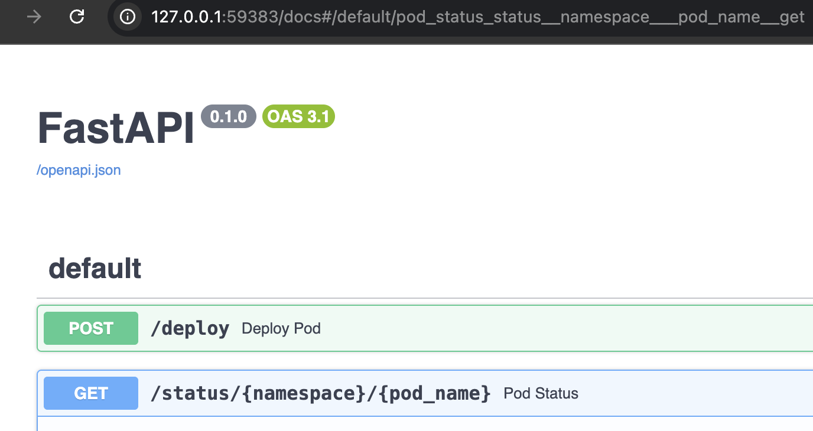
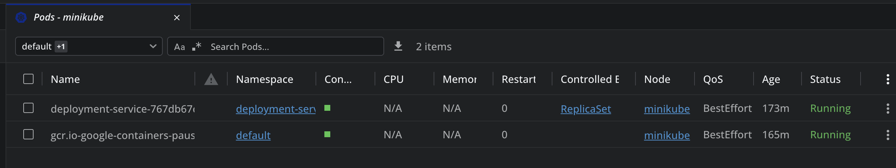
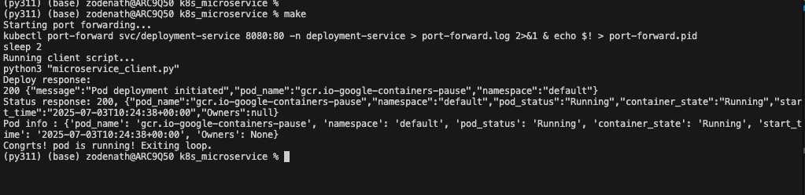
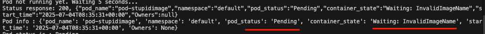

## Project Overview
A minimal Python-based microservice that automates the deployment of a public Docker image to a Kubernetes (k8s) cluster and provides real-time status updates of the deployed pods. Please note that this is only deploying as a "Pod" and not a deployment yet.
Tech Stack :
kubernetes client lib,
minikube,
fastApi


```bash
# Clone the repository
git clone https://github.com/deba46/k8s-deploy-microservice.git
cd k8s-deploy-microservice

python3 -m venv venv
source venv/bin/activate

# Create venv with python >= 3.11 & Install dependencies
pip install -r requirements.txt
# Set minikube docker env
eval $(minikube docker-env)
# Build the image 
docker build -t k8s-deployment-service:v001 .
# Deploy service using kubectl
kubectl apply -f deployment.yaml
kubectl apply -f deployer-rbac,yaml
# Run make , covers functional e2e tests
# Update clinet apps to change namespace name, images etc.
#
make
# To run unit tests
PYTHONPATH=. pytest tests/
```
# Open questions
## 1. Security
### Authentication and Authorization:
    - Only authorized users should be allowed to access the deployment endpoints.E.g Azure AD and OAuth2 tokens
    - At k8s level use k8s rbac role (clusterRole and binding), restrict to namespace level
    - Always use dedicated service accounts for kubernetes workloads and with tightly scoped rbac permissions
   
### Network security
    - Use Valid TLs/SSL certificates . COnfigure microservice to use SSL 
    - Ensure single entry point to the service by using ingress controller. E.g Use of firewalls and network security with ingresses such as Azure app gateway  

### Pod security
    - Follow Pod Security Standards and best practices. E.g setup securityContext and always run as non root user
    - Scan container images for vulnerabilities. E.g Microsoft defender , Trivy etc.
    - Store sensitive information in external vaults . E.g azure keyvault

## 2. Scalability
### Load balancing:
    - Use a load balancer such as API gateway to route requests.
    - Enable horizontal pod scaling based on cpu and memory requirements or Custom metrics with KEDA .
    - Cluster autoscaler to enable automatic add or remove of nodes
### Some steps for app scalability:
    - Async communication - already implemented with kube async io lib.
    - Always create stateless application , to make autoscaling faster and easier
    - USe a caching layer to reduce overload of API server. E.g redis
    - Use watcher Api to avoid polling  - it uses event driven mechanism under hood 
    - Reuse clients and sessions rather than recreating them per request to reduce overhead

## 3. Monitoring
### Audit logging (for deployment_microservice):
    - Kubernetes level audits in case of AKS can be done form Diagnostic Settings.
    - Apps level audits - for every request log identity of user, timestamp, action etc
    - Implement/integrate log monitoring solution.
### Application monitoring ( users of deployment_microservice):
    - Create an unified api to allow users to retrieve health status and  logs of their deployed apps.
      - Create new endpoint for logs. e.g /logs/{deployment_name}
      - If status endpoint provides sufficient info or can be enhanced to add certain health metrics, we are good 
        Otherwise create a new health check endpoint: check of readiness and liveness probe + other metrics.
    - Configure apps to route logs and other info to a platform .Eg ELK stack , Datadog or azure log analytics 
    - Proper documentation and user guidence is needed

## TODO : further enhancements:
- Add code for "deployment" 
- Integrate helm charts and k8s manfiest via client lib 
- Explore kubernetes_asyncio.test package possibly for async tests
- Explore kubernetes_asyncio.watch package for real time status/monitoring
- load testing using tools like locust

## Screenshots
Api Docs:

To open docs : minikube service deployment-service -n deployment-service

K8s Apps:


Run result:


Trying to deploy an invalid Image :

